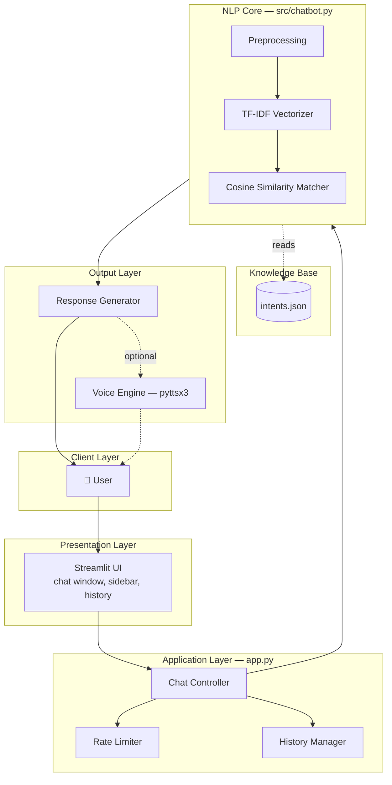

# 🤖 AI Customer Service Chatbot

> An offline, fully-explainable customer support chatbot — no LLM, no API keys, no black box. Built to demonstrate production-grade NLP engineering: TF-IDF + cosine similarity intent matching, rate limiting, structured logging, and 20 passing unit tests across 3 Python versions in CI.
[](...)

[](https://github.com/manvendrasingh0712/customer-service-chatbot/actions/workflows/ci.yml)
[](https://www.python.org/)
[](https://streamlit.io/)
[](LICENSE)
[](https://github.com/manvendrasingh0712/customer-service-chatbot/commits/main)
[](https://github.com/manvendrasingh0712/customer-service-chatbot)
[](https://github.com/manvendrasingh0712/customer-service-chatbot/issues)
[](https://github.com/manvendrasingh0712/customer-service-chatbot/stargazers)
[](https://github.com/manvendrasingh0712/customer-service-chatbot/network/members)

A **rule-based / simple NLP-based chatbot** that answers common customer
service queries — orders, refunds, shipping, payments, complaints — through
a clean chat interface, with optional voice replies.

Built to clearly demonstrate core **NLP techniques and chatbot design**
concepts: text preprocessing, TF-IDF vectorization, cosine similarity
matching, and rule-based fallback handling.

---

## 🌐 Live Demo

🚀 **Try the chatbot online**

[▶️ Open Live Demo](https://customer-service-chatbot-gwvnnf3q7jkzt7mr2uf3n7.streamlit.app/)

No install required — the demo runs the full pipeline in your browser, including chat history, rate limiting, and (if supported by your browser session) voice replies.

---

## 📖 Table of Contents

- [Overview](#-overview)
- [User Interface](#-user-interface)
- [Design Decisions](#-design-decisions)
- [How It Works (NLP Pipeline)](#-how-it-works-nlp-pipeline)
- [Architecture](#-architecture)
- [Project Structure](#-project-structure)
- [Features](#-features)
- [Setup & Installation](#-setup--installation)
- [Running the App](#-running-the-app)
- [Running Tests](#-running-tests)
- [Configuration](#-configuration)
- [Tech Stack](#-tech-stack)
- [Extending the Project](#-extending-the-project)
- [Roadmap](#-roadmap)
- [License](#-license)
- [Conclusion](#-conclusion)

---

## 🧠 Overview

This project implements a customer-support chatbot using a lightweight,
fully-explainable NLP pipeline rather than a black-box LLM — making it
ideal for demonstrating an understanding of foundational NLP and chatbot
design principles.

Unlike LLM-wrapper projects, every response this bot gives can be traced
back to a specific pattern in `intents.json` and a specific similarity
score — there is no hidden reasoning, no hallucination risk, and no
dependency on an external API or paid inference. That makes it fast,
free to run, fully offline, and predictable enough to unit-test
deterministically — which is exactly what the 20-test suite in this repo
does.

| | |
|---|---|
| **Type** | Rule-based + Simple NLP (TF-IDF + Cosine Similarity) |
| **Interface** | Streamlit web chat UI |
| **Voice support** | Optional text-to-speech replies (pyttsx3) |
| **Domain** | E-commerce / customer support (orders, refunds, shipping, payments) |
| **Dependencies** | Fully offline-capable — no external API keys required |
| **Test coverage** | 20 unit tests, CI-validated on Python 3.10 / 3.11 / 3.12 |

---

## 🖥️ User Interface


*A clean, single-page Streamlit chat interface: message history on the main panel, and voice/reset controls in the sidebar.*

> 🎬 **Demo GIF placeholder** — add a short (5–8s) screen recording here showing a real query → matched response → optional voice reply. This is the single highest-impact visual addition for a recruiter skimming the repo, since it proves the app runs end-to-end without requiring a local clone.

---

## 🎯 Design Decisions

Every core technical choice in this project was made deliberately, with
explicit tradeoffs — not by default. This section documents the reasoning.

### Why TF-IDF?

TF-IDF (Term Frequency–Inverse Document Frequency) converts text into
numeric vectors weighted by how *distinctive* a word is to a pattern,
rather than just how frequent it is. For a small, well-defined domain
like customer service intents (a few dozen patterns per intent, a fixed
vocabulary of order/refund/shipping terminology), TF-IDF gives:

- **Deterministic, debuggable matches** — the exact vector and score for
  any input can be inspected and explained, unlike embedding-based
  similarity which is opaque without extra tooling.
- **Zero training cost** — vectorization happens once at startup directly
  from `intents.json`; there's no model to train, fine-tune, or version.
- **Good enough accuracy for a bounded domain** — when the vocabulary is
  small and patterns are well-curated, TF-IDF competes closely with
  heavier embedding approaches while being orders of magnitude cheaper.

**Tradeoff acknowledged:** TF-IDF matches on lexical overlap, not
semantic meaning — it won't reliably catch a paraphrase with no shared
vocabulary (e.g., *"I don't want this anymore"* vs. *"cancel my order"*).
This is a known limitation, and the [Roadmap](#-roadmap) below outlines
the upgrade path to embeddings once semantic generalization is required.

### Why Cosine Similarity?

Cosine similarity measures the angle between two vectors rather than
their magnitude, which matters because customer messages vary widely in
length — a 3-word query and a 15-word query about the same issue should
still be recognized as similar. Cosine similarity is:

- **Length-invariant**, unlike Euclidean distance, which would penalize
  longer or shorter messages unfairly.
- **Cheap to compute** at this scale (a few dozen patterns), keeping the
  entire matching step well under interactive latency.
- **Easy to threshold** — a single scalar score (0–1) maps cleanly onto
  the `CONFIDENCE_THRESHOLD` fallback logic, keeping the decision rule
  simple and auditable.

### Why Rule-Based NLP Instead of an LLM?

This was the most consequential design decision in the project, and it
was made intentionally rather than as a limitation:

| Factor | Rule-based (this project) | LLM-based |
|---|---|---|
| Cost | Free, runs anywhere | Per-token API cost or GPU hosting |
| Latency | Milliseconds | Hundreds of ms – seconds |
| Explainability | Fully traceable to a pattern + score | Opaque reasoning |
| Reliability | Same input → same output, always | Can vary or hallucinate |
| Offline capability | Fully offline | Requires network/API access |
| Setup complexity | `pip install`, no keys | API key management, rate limits |

For a **bounded-domain customer service assistant**, where the set of
realistic user intents is finite and known in advance, an LLM's
generative flexibility is mostly unused upside while its cost,
latency, and hallucination risk are fully realized downside. The
rule-based approach trades some semantic flexibility for
**predictability, auditability, and zero operating cost** — properties
that matter more in a support context, where a confidently wrong answer
is worse than an honest "I don't understand, could you rephrase?"

This is also why the project intentionally documents both approaches
rather than treating the LLM route as a strictly "better" future
upgrade — it's a genuine architectural tradeoff, not an unfinished one.

---

## ⚙️ How It Works (NLP Pipeline)

```
User Input
   │
   ▼
Preprocessing (lowercase, remove punctuation, remove stopwords)
   │
   ▼
TF-IDF Vectorization  (converts text -> numeric vectors)
   │
   ▼
Cosine Similarity vs. all known patterns in intents.json
   │
   ├── score ≥ 0.20  → matched intent  → random response from that intent
   └── score < 0.20  → fallback intent → "I didn't understand, could you rephrase?"
```

1. **Knowledge base (`intents.json`)** — organizes customer service topics
   into *intents*, each with sample `patterns` (things a user might type)
   and possible `responses`.
2. **Text preprocessing** — lowercasing, punctuation stripping, and stopword
   removal, implemented with a small built-in stopword list (no external
   NLTK downloads required — works fully offline).
3. **TF-IDF vectorization** — `sklearn.feature_extraction.text.TfidfVectorizer`
   converts every known pattern into a numeric vector at startup.
4. **Cosine similarity matching** — the user's message is vectorized the
   same way and compared against every known pattern to find the closest
   intent.
5. **Rule-based fallback** — if the best similarity score is below a
   confidence threshold, the bot admits it doesn't know rather than
   guessing incorrectly — this keeps responses trustworthy.

---

## 🏗️ Architecture

A layered view of how a message flows from the user through the NLP
core and back, showing separation of concerns between presentation,
application, core NLP logic, and the knowledge base.



<details>
<summary>📄 ASCII fallback (click to expand — for environments without Mermaid rendering)</summary>

```
┌──────────┐      ┌────────────────────┐      ┌─────────────────────┐
│   User   │ ───▶ │ Streamlit Frontend │ ───▶ │  Chat Controller     │
└──────────┘      │      (app.py)      │      │  (session, rate      │
                   └────────────────────┘      │   limiting, history) │
                                                └──────────┬───────────┘
                                                            ▼
                                                ┌─────────────────────┐
                                                │     NLP Engine       │
                                                │  (src/chatbot.py)    │
                                                └──────────┬───────────┘
                                                            ▼
                              ┌─────────────────────────────────────────┐
                              │  Preprocessing → TF-IDF → Cosine Sim     │
                              └──────────────────┬────────────────────┘
                                                  ▼
                                       ┌─────────────────────┐
                                       │  Score ≥ 0.20 ?      │
                                       └─────┬───────────┬────┘
                                        Yes  │           │  No
                                             ▼           ▼
                                 ┌──────────────┐  ┌──────────────┐
                                 │Intent Matched│  │  Fallback     │
                                 └──────┬───────┘  └──────┬───────┘
                                        └────────┬────────┘
                                                  ▼
                                     ┌─────────────────────┐
                                     │  Response Generator  │
                                     └──────────┬───────────┘
                                                ▼
                                     ┌─────────────────────┐
                                     │ Voice Engine (opt.)  │
                                     └──────────┬───────────┘
                                                ▼
                                          ┌──────────┐
                                          │  Output   │
                                          └──────────┘
```
</details>

---

## 📂 Project Structure

```
customer-service-chatbot/
├── .github/
│   └── workflows/
│       └── ci.yml            # GitHub Actions: lint + test on every push
├── .streamlit/
│   └── config.toml           # Theme & server config for deployment
├── src/
│   ├── __init__.py
│   └── chatbot.py            # NLP engine (TF-IDF + Cosine Similarity)
├── tests/
│   ├── __init__.py
│   └── test_chatbot.py       # 20 unit tests covering NLP matching & edge cases
├── app.py                    # Streamlit UI (chat, history, voice, rate limiting)
├── config.py                 # Centralized configuration constants
├── intents.json              # Knowledge base: intents, patterns, responses
├── requirements.txt          # Runtime dependencies
├── requirements-dev.txt      # Dev dependencies (pytest, flake8, black)
├── setup.cfg                 # Flake8 lint configuration
├── .gitignore
├── LICENSE
└── README.md
```

---

## ✅ Features

- **Zero hallucination risk** — confidence-threshold fallback (0.20) means
  the bot never guesses; it admits uncertainty instead of fabricating answers
- **Fully offline & explainable** — no external API calls, no black-box LLM;
  every match is traceable to a specific intent pattern
- **Production-safety features** — rate limiting, input length validation,
  and memory-bounded history prevent abuse and unbounded RAM growth
- **Multi-version CI** — validated automatically on Python 3.10, 3.11, and
  3.12 via GitHub Actions on every push
- **20 unit tests, zero lint warnings** (flake8) — covers NLP matching edge
  cases, not just happy paths
- **Graceful degradation** — voice replies (pyttsx3) auto-disable on servers
  without a TTS driver instead of crashing
- **Session-isolated chat history** — safe for multiple concurrent users
- **Structured logging** to both console and `chatbot.log` for observability
- **Centralized configuration** (`config.py`) for easy tuning without
  touching core logic

---

## 🚀 Setup & Installation

```bash
# 1. Clone the repository
git clone https://github.com/manvendrasingh0712/customer-service-chatbot.git
cd customer-service-chatbot

# 2. Create a virtual environment
python -m venv venv

# Activate it:
venv\Scripts\Activate.ps1     # Windows PowerShell
venv\Scripts\activate.bat     # Windows CMD
source venv/bin/activate      # macOS / Linux

# 3. Install dependencies
pip install -r requirements.txt
```

> **Note:** Voice replies require a system TTS driver (e.g. `espeak` on
> Linux: `sudo apt-get install espeak`). If unavailable, the app detects
> this automatically and disables the voice feature instead of crashing.

---

## ▶️ Running the App

```bash
streamlit run app.py
```

Then open the URL shown in the terminal (usually `http://localhost:8501`).

---

## 🧪 Running Tests

```bash
pip install -r requirements-dev.txt
pytest -v
```

Lint check:

```bash
flake8 .
```

---

## 🔧 Configuration

All tunable values live in `config.py`:

| Constant | Default | Purpose |
|---|---|---|
| `HISTORY_LIMIT` | 20 | Max messages kept per session |
| `RATE_LIMIT_SECONDS` | 1.5 | Minimum gap between messages |
| `MAX_MESSAGE_LENGTH` | 500 | Max characters per message |
| `CONFIDENCE_THRESHOLD` | 0.20 | Minimum similarity score to accept a match |
| `TTS_RATE` | 200 | Speech rate (words per minute) |

---

## 🛠️ Tech Stack

<table>
<tr>
<td valign="top" width="50%">

**Core NLP**
- Python 3.10+
- scikit-learn — TF-IDF vectorization & cosine similarity

**Interface**
- Streamlit — web chat interface
- pyttsx3 — offline text-to-speech

</td>
<td valign="top" width="50%">

**Quality & Tooling**
- pytest — 20 unit tests
- flake8 — zero-warning linting
- GitHub Actions — CI across 3 Python versions

**Deployment**
- Streamlit Community Cloud

</td>
</tr>
</table>

---

## 🧩 Extending the Project

- **Add more intents**: add new objects to `intents.json` with a `tag`,
  a list of `patterns`, and a list of `responses` — no code changes needed.
- **Improve NLP**: swap `TfidfVectorizer` for word embeddings (e.g. spaCy
  vectors or Sentence-Transformers) for more nuanced semantic matching.
- **Add conversational memory**: track the last matched intent in
  `st.session_state` to support multi-turn context (e.g. "cancel it"
  referring to a previously mentioned order).
- **Connect a real backend**: replace static responses with live calls to
  an orders/refunds API for real-time answers.
- **Containerize**: add a `Dockerfile` for one-command deployment.

---

## 🗺️ Roadmap

- [ ] Migrate lint tooling from `flake8` to `ruff` + add pre-commit hooks
- [ ] Add test coverage reporting and a coverage badge
- [ ] Introduce semantic matching (spaCy / Sentence-Transformers) as an
      optional upgrade path alongside TF-IDF, benchmarked against it
- [ ] Add multi-turn conversational memory (`st.session_state`-based
      context tracking for references like "cancel it")
- [ ] Connect a real orders/refunds backend for live data instead of
      static responses
- [ ] Add a `Dockerfile` for containerized, one-command deployment
- [ ] Tag a `v1.0.0` release and enable Dependabot + CodeQL scanning
- [ ] Add CONTRIBUTING.md, issue templates, and PR template

---

## 📄 License

This project is licensed under the [MIT License](LICENSE).

---

## 🎯 Conclusion

This project is a deliberately-scoped demonstration of what production-minded
NLP engineering looks like at a small scale: a fully explainable,
offline-capable pipeline (TF-IDF → cosine similarity → confidence-gated
fallback) wrapped in a real interface, backed by 20 tests and a
multi-version CI matrix, rather than a single script that happens to run.

Every architectural choice here — rule-based over LLM, TF-IDF over
embeddings, cosine over Euclidean distance — was made for specific,
documented reasons rather than by default, and the [Roadmap](#-roadmap)
above lays out exactly where the system's current tradeoffs would be
revisited as requirements grow. That combination — working software,
test discipline, and honest architectural reasoning — is the goal of
this repository, and contributions or suggestions toward any item on the
roadmap are welcome.
