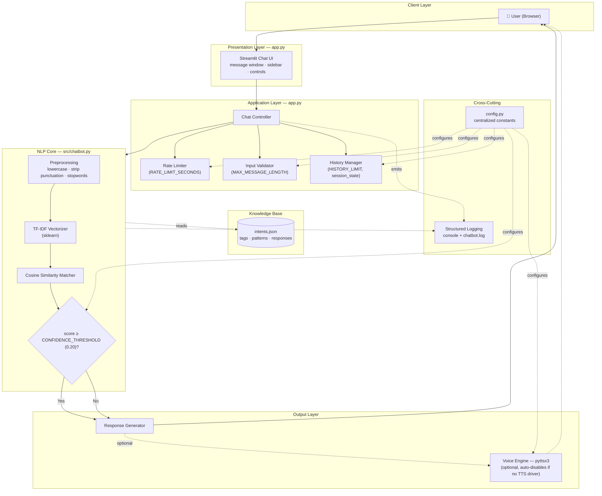
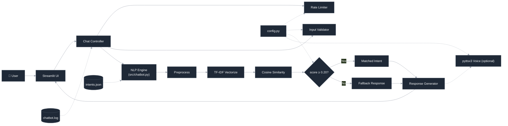
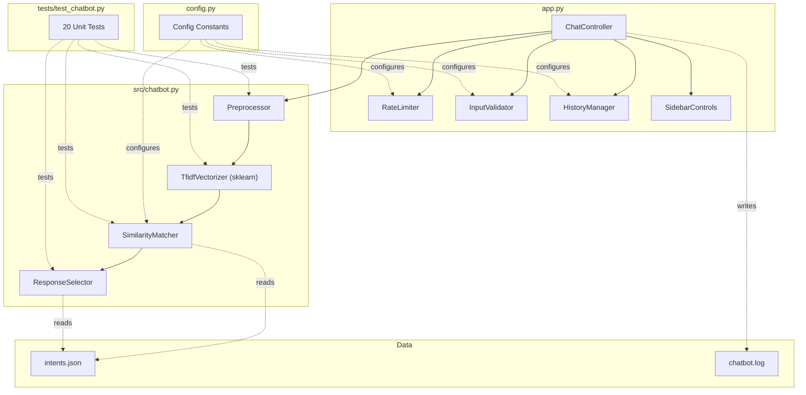
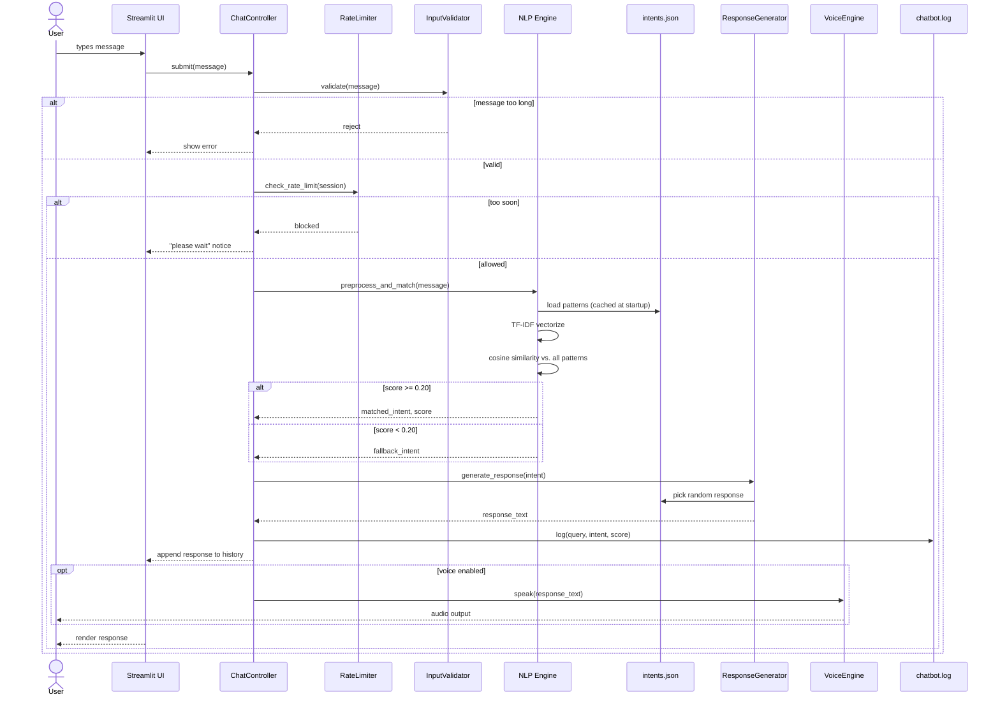
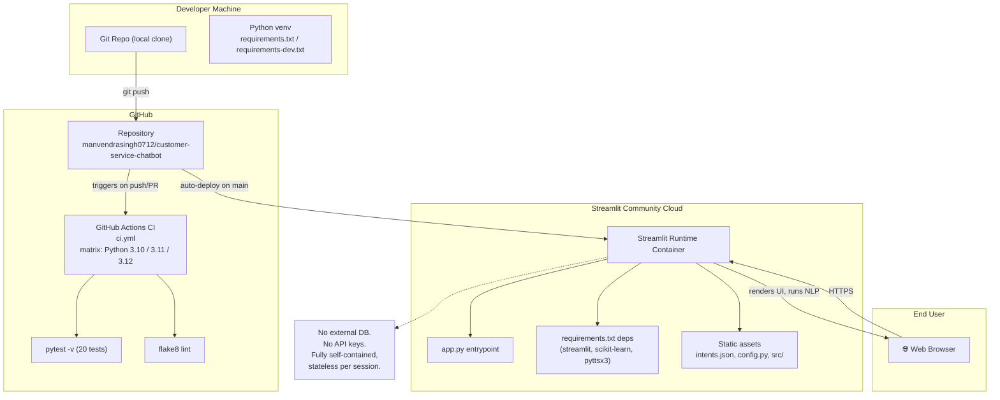
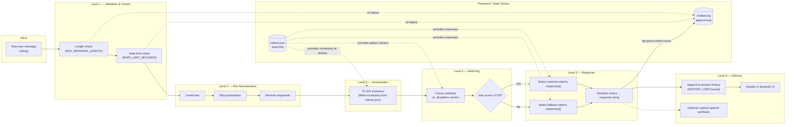

# 🏛️ System Architecture — AI Customer Service Chatbot

> Companion document to `README.md`. Contains full architecture diagrams: Mermaid (render + SVG-export ready), ASCII, Component, Sequence, Deployment, and Data Flow views.

---

## 1. Mermaid — High-Level Architecture



---

## 2. SVG-Ready Mermaid Diagram

Use this block directly with `mmdc` (mermaid-cli) to export a standalone SVG:

```bash
npm install -g @mermaid-js/mermaid-cli
mmdc -i architecture.mmd -o architecture.svg -b transparent -w 1600 -H 1000
```

`architecture.mmd`:



---

## 3. High-Quality ASCII Architecture

```
┌────────────────────────────────────────────────────────────────────────┐
│                              CLIENT LAYER                               │
│                              👤  User (Browser)                         │
└───────────────────────────────────┬────────────────────────────────────┘
                                     │ HTTP / WebSocket (Streamlit)
                                     ▼
┌────────────────────────────────────────────────────────────────────────┐
│                     PRESENTATION LAYER  (app.py)                        │
│   ┌────────────────────────────────────────────────────────────────┐   │
│   │  Streamlit Chat UI                                              │   │
│   │  • message history panel   • sidebar (voice toggle / reset)     │   │
│   └───────────────────────────────┬────────────────────────────────┘   │
└───────────────────────────────────┼────────────────────────────────────┘
                                     ▼
┌────────────────────────────────────────────────────────────────────────┐
│                    APPLICATION LAYER  (app.py)                          │
│  ┌───────────────┐   ┌──────────────────┐   ┌─────────────────────┐    │
│  │ Chat Controller│──▶│  Rate Limiter    │   │  Input Validator     │   │
│  │  (orchestrates)│   │ (RATE_LIMIT_SEC) │   │ (MAX_MESSAGE_LENGTH) │   │
│  └───────┬───────┘   └──────────────────┘   └─────────────────────┘    │
│          │            ┌──────────────────┐                              │
│          └───────────▶│  History Manager │  (HISTORY_LIMIT,             │
│                        │                  │   st.session_state)         │
│                        └──────────────────┘                              │
└───────────────────────────────────┬────────────────────────────────────┘
                                     ▼
┌────────────────────────────────────────────────────────────────────────┐
│                   NLP CORE LAYER  (src/chatbot.py)                      │
│                                                                          │
│   Preprocessing  ──▶  TF-IDF Vectorizer  ──▶  Cosine Similarity Match   │
│  (lowercase,          (sklearn                (score vs. every known    │
│   strip punct,         TfidfVectorizer)        pattern in intents.json) │
│   stopwords)                                                            │
│                                                        │                │
│                                             ┌──────────┴──────────┐     │
│                                             ▼                     ▼     │
│                                    score ≥ 0.20            score < 0.20 │
│                                    Matched Intent          Fallback     │
└───────────────────────────────────┬────────────────────────────────────┘
                                     │  reads (read-only, loaded at startup)
                        ┌────────────┴────────────┐
                        │      intents.json         │
                        │  {tag, patterns[], responses[]} │
                        └────────────┬────────────┘
                                     ▼
┌────────────────────────────────────────────────────────────────────────┐
│                        OUTPUT LAYER                                     │
│   ┌───────────────────────┐        ┌────────────────────────────┐      │
│   │  Response Generator    │───────▶│  Voice Engine (pyttsx3)     │      │
│   │ (random pick from      │        │  optional · TTS_RATE        │      │
│   │  matched responses[])  │        │  auto-disables w/o driver   │      │
│   └───────────┬────────────┘        └──────────────┬──────────────┘      │
└───────────────┼─────────────────────────────────────┼──────────────────┘
                 ▼                                     ▼
            back to UI                          spoken audio (optional)

┌────────────────────────────────────────────────────────────────────────┐
│  CROSS-CUTTING CONCERNS                                                 │
│  config.py  → HISTORY_LIMIT, RATE_LIMIT_SECONDS, MAX_MESSAGE_LENGTH,    │
│                CONFIDENCE_THRESHOLD, TTS_RATE                          │
│  logging    → console + chatbot.log (structured, all layers)           │
└────────────────────────────────────────────────────────────────────────┘
```

---

## 4. Component Diagram



**Component responsibilities**

| Component | File | Responsibility |
|---|---|---|
| `ChatController` | `app.py` | Orchestrates request lifecycle: validate → rate-limit → match → respond → log |
| `RateLimiter` | `app.py` | Enforces `RATE_LIMIT_SECONDS` gap between messages |
| `InputValidator` | `app.py` | Rejects messages exceeding `MAX_MESSAGE_LENGTH` |
| `HistoryManager` | `app.py` | Bounds session history to `HISTORY_LIMIT`, session-isolated |
| `Preprocessor` | `src/chatbot.py` | Lowercasing, punctuation stripping, stopword removal (built-in list, offline) |
| `TfidfVectorizer` | `src/chatbot.py` | Fits vocabulary from `intents.json` patterns at startup |
| `SimilarityMatcher` | `src/chatbot.py` | Computes cosine similarity, applies `CONFIDENCE_THRESHOLD` gate |
| `ResponseSelector` | `src/chatbot.py` | Picks a random response from the matched (or fallback) intent |
| `Config` | `config.py` | Single source of truth for all tunables |

---

## 5. Sequence Diagram



---

## 6. Deployment Diagram



**Deployment notes**

- No database, message broker, or external API — the entire app is a single Streamlit process reading `intents.json` from disk at startup.
- `pyttsx3` voice output depends on host TTS drivers (e.g. `espeak` on Linux); Streamlit Community Cloud containers may lack this — the app detects and disables voice gracefully rather than crashing.
- CI (GitHub Actions) is a build-time gate only; it does not participate in the runtime deployment path.
- Horizontal scaling = spinning up more identical stateless container instances (session state lives in Streamlit's per-session memory, not shared storage).

---

## 7. Data Flow Diagram



**Data flow summary**

| Stage | Input | Transformation | Output |
|---|---|---|---|
| Validation | Raw string | Length + rate-limit checks | Accepted / rejected message |
| Normalization | Accepted message | Lowercase, punctuation strip, stopword removal | Clean token string |
| Vectorization | Clean tokens | TF-IDF transform (fixed vocab from `intents.json`) | Numeric vector |
| Matching | Vector | Cosine similarity vs. pattern vectors | Best-match score + intent tag |
| Response | Intent tag | Threshold gate (0.20) → response pool lookup | Response string |
| Delivery | Response string | Append to bounded history, render, optional TTS | UI update + optional audio |
| Observability | Every stage | Structured log write | `chatbot.log` entry |

---

*Generated to accompany the `customer-service-chatbot` README — reflects the actual `app.py` / `src/chatbot.py` / `config.py` / `intents.json` structure with no invented components.*
